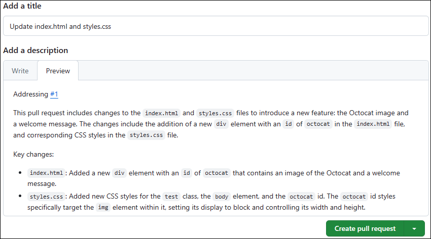

---
lab:
  title: Implémenter un flux de travail avec GitHub
  module: Develop with DevOps
---

# Labo 02 - Implémenter un flux de travail avec GitHub

## Durée estimée : 30 minutes

## Scénario

N’oubliez pas ce scénario de module selon lequel vous travaillez pour une entreprise de développement de logiciels dans le secteur de la vente au détail qui envisage de migrer un magasin en ligne d’une ancienne application vers une nouvelle application appelée eShopOnWeb. Étant donné que vous avez décidé d’utiliser Git et GitHub pour faciliter la gestion du cycle de vie des applications, ce labo vous donne la possibilité de commencer par dupliquer (fork) un dépôt existant, de le configurer, de créer un problème, de créer une branche, de mettre à jour des fichiers dans la branche, de créer et de fusionner une demande de tirage (pull request), de fermer le problème et de valider les modifications.

## Objectifs

Dans ce labo, vous allez :

- Implémenter et gérer des référentiels avec GitHub

> **Remarque :** Pour ce labo et les suivants, utilisez le même compte GitHub que vous avez créé pour le premier labo.

## Prérequis

- [Labo 01 - Planification et gestion agiles avec GitHub](01-agile-planning-management-using-github.md) terminé

## Exercice 1 : Implémenter et gérer des référentiels avec GitHub

Dans cet exercice, vous allez dupliquer (fork) un référentiel Git et le gérer à l’aide de GitHub.

> **Important :** L’utilisation de la fonctionnalité GitHub Copilot pour demande de tirage est totalement facultative. Pour utiliser cette fonctionnalité, vous devez être membre d’une entreprise avec un **abonnement Copilot Enterprise**. Vous pouvez ignorer les étapes qui impliquent la fonctionnalité GitHub Copilot pour demande de tirage si vous n’y avez pas accès. Si vous souhaitez en savoir plus sur la fonctionnalité GitHub Copilot pour demande de tirage, consultez [À propos des résumés de demandes de tirage Copilot](https://docs.github.com/en/enterprise-cloud@latest/copilot/github-copilot-enterprise/copilot-pull-request-summaries/about-copilot-pull-request-summaries).

> **Remarque :** Vous avez créé un dépôt dans le premier labo de notre cours. Dans ce labo, vous allez commencer par dupliquer un dépôt existant. Une fourche est un dépôt qui partage les paramètres de code et de visibilité avec un dépôt en amont existant. Cette approche est fréquemment utilisée lors du développement de mises à jour pour des projets open source ou dans des scénarios où l’accès en écriture au dépôt en amont n’est pas disponible. Pour plus d’informations, reportez-vous à [Utilisation des fourches](https://docs.github.com/en/pull-requests/collaborating-with-pull-requests/working-with-forks).

L’exercice se compose des tâches suivantes :

- Tâche 1 : Dupliquer un dépôt GitHub
- Tâche 2 : Configurer un dépôt GitHub
- Tâche 3 : Créer un problème
- Tâche 4 : Créer une branche
- Tâche 5 : Mettre à jour les fichiers dans la branche
- Tâche 6 : Créer et fusionner une demande de tirage
- Tâche 7 : Fermer le problème
- Tâche 8 : Valider les modifications

### Tâche 1 : Dupliquer un dépôt GitHub

1. Démarrez un navigateur web et accédez à la page d’accueil de [GitHub](https://github.com).
1. Lorsque vous êtes invité à vous authentifier, connectez-vous avec votre compte d’utilisateur GitHub.
1. Ouvrez un autre onglet dans la même fenêtre de navigateur et accédez au dépôt [Spoon-Knife](https://github.com/octocat/Spoon-Knife).
1. Dans la page du dépôt **Spoon-Knife**, sélectionnez **Fourche**.
1. Dans la page **Créer une fourche**, vérifiez que l’entrée **Propriétaire** dans la liste déroulante affiche votre nom d’utilisateur GitHub. Acceptez l’entrée par défaut **Spoon-Knife** dans la zone de texte **Nom du dépôt**, laissez la case **Copier la branche principale uniquement** cochée, puis sélectionnez **Créer une fourche**.

   > **Remarque :** Votre session de navigateur est automatiquement redirigée vers le dépôt qui vient d’être dupliqué.

### Tâche 2 : Configurer un dépôt GitHub

1. Dans la page du dépôt **Spoon-Knife** dupliqué, dans la barre d’outils, sélectionnez **Paramètres**.
1. Dans la section **Général** de l’onglet **Paramètres**, notez que la branche par défaut est définie sur **principale*.
1. Accédez à la zone **Fonctionnalités** de la section **Général** et cochez la case **Problèmes**.
1. Dans le menu de navigation de gauche, dans le regroupement **Code et automatisation**, sélectionnez l’entrée **Pages**.
1. Dans le volet **GitHub Pages**, dans la section Branche, remplacez l’entrée **Aucune** dans la liste déroulante par **principale**, puis sélectionnez **Enregistrer**.

   > **Remarque :** GitHub Pages publie automatiquement le contenu du dépôt sur un site accessible via l’URL `https://<your_GitHub_username>.github.io/Spoon-Knife/`.

1. Dans le volet **GitHub Pages**, sélectionnez le bouton **Visiter le site**. Cette action ouvre automatiquement un autre onglet de navigateur web et affiche la page représentant le contenu actuel du fichier index.html.

   > **Remarque :** Vous devrez probablement attendre quelques minutes avant que le bouton **Visiter le site** et que la page ne soient disponibles.

   > **Remarque :** Effectuez les étapes restantes de cette tâche si vous avez terminé le premier labo.

1. De retour dans la page du dépôt **Spoon-Knife** dupliqué, dans la barre d’outils, sélectionnez **Projets**.
1. Dans le volet **Bienvenue dans les tout nouveaux projets**, sélectionnez **Lier un projet**, puis dans le menu déroulant, sélectionnez **Lier un projet existant**.
1. Dans la liste des projets existants, sélectionnez **Projet d’introduction DevOps Core**.

### Tâche 3 : Créer un problème

1. Dans la page du dépôt dupliqué **Spoon-Knife**, sélectionnez l’onglet **Problèmes**.
1. Dans la page **Bienvenue dans la section des problèmes !**, sélectionnez **Nouveau problème**.
1. Dans la zone de texte **Ajouter un titre**, entrez **`index.html looks rather austere`**.
1. Dans la zone de texte **Ajouter une description**, entrez **`index.html file can use a modern touch`**.
1. Dans le volet actif, dans la section Destinataires, sélectionnez **Ajouter des destinataires…**, puis dans la section **Suggestions**, sélectionnez votre nom d’utilisateur GitHub.
1. Sélectionnez l’icône d’engrenage à côté de l’entrée **Étiquettes**, puis dans la liste déroulante, sélectionnez **amélioration**.
1. Sélectionnez l’icône d’engrenage à côté de l’entrée **Projets**, puis dans la liste déroulante, sélectionnez **Projet d’introduction DevOps Core**.
1. Sélectionnez **Créer** pour enregistrer le nouveau problème.
1. Ouvrir à nouveau le nouveau problème
1. Dans le volet **index.html semble plutôt austère**, dans la section **Projets**, définissez **État** sur **En cours**.
1. Dans la page du dépôt dupliqué **Spoon-Knife**, sélectionnez l’onglet **Projets**.
1. Dans la page **Bienvenue dans les tout nouveaux projets**, sélectionnez **Projet d’introduction DevOps Core**.
1. Dans la vue du tableau du **Projet d’introduction DevOps Core**, examinez la colonne **En cours** et notez qu’elle inclut le problème nouvellement créé.

### Tâche 4 : Créer une branche

1. Revenez à l’onglet **Code**.
1. Dans le coin supérieur gauche de la page, sélectionnez l’entrée **principale** pour afficher la liste déroulante **Changer de branches/d’étiquettes**.
1. Dans la zone de texte **Rechercher ou créer une branche...**, entrez **`update index.html`**, puis sélectionnez **Créer une branche : mettre à jour index.html à partir de l’entrée « principale »** pour créer une branche.

   > **Remarque :** La branche nouvellement créée devient alors automatiquement la branche active, comme indiqué par le contenu de la liste déroulante.

### Tâche 5 : Mettre à jour les fichiers dans la branche

1. Dans la page du dépôt dupliqué**Spoon-Knife**, dans la liste des fichiers, sélectionnez **index.html**.
1. Dans la page **Spoon-Knife/index.html**, sur le côté droit de la barre d’outils de l’éditeur de code, sélectionnez l’icône de crayon pour basculer en mode éditeur.
1. Dans le volet de l’éditeur, remplacez l’ensemble de l’élément de corps de la page (lignes 12-17) par le code HTML suivant :

   ```html
   <div id="octocat">
     
   </div>

   <p>
     Ready to team up? Let's collaborate, @octocat!
   </p>
   ```

1. En haut à droite de la page de l’éditeur, sélectionnez **Commiter les modifications...**.
1. Dans la fenêtre **Valider les modifications**, dans la zone de texte **Description étendue**, entrez **`Modified the image and paragraph text`**, acceptez le message de validation par défaut, puis sélectionnez **Valider les modifications**.

   > **Remarque :** À ce stade, vous avez également la possibilité de créer une branche pour le commit.

1. Dans la liste des fichiers de dépôt sur le côté gauche, sélectionnez **styles.css**.
1. Dans la page **Spoon-Knife/styles.css**, sur le côté droit de la barre d’outils de l’éditeur de code, sélectionnez l’icône de crayon pour basculer en mode éditeur.
1. Dans le volet de l’éditeur, remplacez la ligne 17 par le code HTML entier suivant :

   ```css
     color: #333;
     line-height: 1.5;
     text-align: center;
   }

   body {
     font-family: 'Segoe UI', Tahoma, Geneva, Verdana, sans-serif;
     background-color: #f8f9fa;
   }

   #octocat img {
     display: block;
     width: 100%;
     height: auto;
   }
   ```

1. En haut à droite de la page de l’éditeur, sélectionnez **Commiter les modifications...**.
1. Dans la fenêtre **Valider les modifications**, dans la zone de texte **Description étendue**, entrez **`Modified CSS tags and selectors`**, acceptez le message de validation par défaut, puis sélectionnez **Valider les modifications** pour valider les modifications dans la branche update-index.html.

### Tâche 6 : Créer et fusionner une demande de tirage

1. Revenez à la page du dépôt dupliqué **Spoon-Knife**.
1. Vérifiez bien que vous voyez la branche **update-index.html**, comme indiqué par l’étiquette qui apparaît dans la liste déroulante en haut à gauche de la page. Si cette étiquette affiche **principale**, sélectionnez-la en premier, puis dans la liste déroulante contenant la liste des branches, sélectionnez **update-index.html**.
1. Dans la page du dépôt dupliqué **Spoon-Knife**, sélectionnez **Contribuer**, puis **Ouvrir la demande de tirage**.
1. Dans la page **Ouvrir une demande de tirage**, sélectionnez l’entrée **dépôt de base : octocat/Spoon-Knife**.
1. Dans la liste déroulante **Choisir un dépôt de base**, sélectionnez le nom du dépôt dupliqué que vous avez créé au début de ce labo.

   > **Remarque :** Le nom commence par votre nom GitHub, suivi d’une barre oblique, suivi de **Spoon-Knife**. Une fois que vous l’avez sélectionné, l’entrée devrait changer en **base : principale**.

   > **Remarque :** C’est nécessaire parce que nous voulons mettre à jour la branche principale du dépôt dupliqué, et non la branche principale du dépôt à partir duquel vous avez créé la fourche.

1. Dans la zone de texte **Ajouter un titre**, remplacez **Mettre à jour index.html** par **Mettre à jour index.html et styles.css**.

1. (Facultatif) Si vous avez accès à la fonctionnalité GitHub Copilot pour demande de tirage, dans la zone de texte **Ajouter une description**, cliquez sur le bouton **Action Copilot**, puis sélectionnez **Résumé** (Générer un résumé des modifications de la demande de tirage).

   1. La fonctionnalité GitHub Copilot pour demande de tirage génère un résumé des modifications de la demande de tirage.

       

   1. Passez en revue le résumé généré par la fonctionnalité GitHub Copilot pour demande de tirage.

   1. Une fois le résumé généré, entrez **`Addressing #1`** dans **Ajouter une description** sur la première ligne, puis sélectionnez **Créer une demande de tirage**.

       

   > **Remarque :** Si vous n’avez pas accès à la fonctionnalité GitHub Copilot pour demande de tirage, vous pouvez ignorer cette étape.

   > **Remarque :** Si vous choisissez d’utiliser la fonctionnalité GitHub Copilot pour demande de tirage, vous pouvez ignorer la prochaine étape.

1. Dans la zone de texte **Ajouter une description**, entrez **`Addressing #1`** et sélectionnez **Créer une demande de tirage**.

   > **Remarque :** En incluant **n°1**, vous pouvez référencer le premier problème associé à cette demande de tirage.

1. Vérifiez que la branche actuelle n’a aucun conflit avec la branche de base, sélectionnez **Fusionner la demande de tirage**, puis **Confirmer la fusion**.
1. Vérifiez que la demande de tirage a été fusionnée et fermée, puis sélectionnez **Supprimer la branche**.

### Tâche 7 : Fermer le problème

1. Dans la barre d’outils de la page GitHub, sélectionnez l’onglet **Problèmes**.
1. Cochez la case à gauche du premier problème **index.html semble plutôt austère**, sélectionnez **Marquer comme**, puis dans la liste déroulante, sélectionnez **Fermé**.
1. Revenez à la vue tableau du **Projet d’introduction DevOps Core** et remarquez que le problème apparaît maintenant dans la colonne **Terminé**.

### Tâche 8 : Valider les modifications

1. Dans la fenêtre du navigateur web, revenez à la page de votre dépôt dupliqué **Spoon-Knife**, sélectionnez l’onglet **Paramètres**, puis, dans le menu de navigation de gauche, dans le regroupement **Code et automatisation**, sélectionnez **Pages** pour afficher le volet **GitHub Pages**.
1. Dans le volet **GitHub Pages**, sélectionnez **Visiter le site** pour ouvrir un autre onglet de navigateur affichant le contenu mis à jour du fichier index.html.
1. Vérifiez que la page a été mise à jour pour inclure les éléments visuels référencés dans les fichiers HTML et CSS.

> **Remarque :** À ce stade, vous pourriez éventuellement soumettre des modifications à la branche principale de votre fourche dans le dépôt d’origine. Ce serait typiquement la prochaine étape à effectuer lors d’un développement de mises à jour et d’une collaboration sur des projets open source. Toutefois, étant donné que le dépôt d’origine n’est pas conservé, cette étape n’est pas applicable ici.
